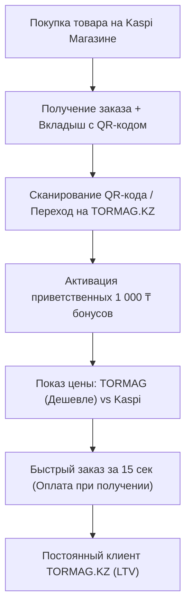

# 🚀 Стратегия перевода покупателей из Kaspi в постоянных клиентов TORMAG.KZ

Данный документ описывает пошаговую стратегию роста (**Kaspi Retention Funnel**), позволяющую использовать **Kaspi Магазин** в качестве основного канала привлечения первичных клиентов, а затем переводить их на собственную платформу **TORMAG.KZ** за счет лучших цен, кешбэка и удобной оплаты при получении.

---

## 🎯 1. Общая концепция и бизнес-модель

### Проблема комиссии маркетплейсов:
* **Kaspi Магазин** удерживает от **8% до 15%** комиссии с каждого проданного строительного товара.
* Новые клиенты не знают и не доверяют новому сайту напрямую, но доверяют Kaspi.

### Решение (Воронка конверсии):
1. **Привлечение (Kaspi):** Продавать первичные товары на Kaspi Магазине.
2. **Вкладыш в посылку:** Вкладывать в каждый доставленный заказ стильную карточку/визитку с QR-кодом и выгодой прямого заказа.
3. **Мотивация перехода (Tormag.kz):** На Tormag.kz цена ниже на 5-10% (за счет сохраненной комиссии Kaspi) + дарятся приветственные **1 000 ₸ бонусов**.
4. **Модель доверия (Без риска):** На Tormag.kz **НЕТ предоплаты**. Клиент оформляет заказ за 15 секунд и оплачивает его (наличными или Kaspi QR курьеру) **ТОЛЬКО ПОСЛЕ проверки товара при получении на объекте**.

---

## 🔄 2. Пошаговая воронка работы с клиентом



---

## 🛠️ 3. Технические механики для реализации на TORMAG.KZ

### 🎟️ Механика 1. Промокод & Приветственные бонусы (`Welcome Bonus`)
* **Вкладыш в коробку Kaspi:** *"Спасибо за покупку! Введите промокод `KASPI1000` на Tormag.kz и получите 1 000 ₸ на счет!"*.
* **Реализация в коде:**
  * Добавить пресет промокода `KASPI1000` в модель `Promotion` (Prisma).
  * Начисление 1 000 бонусных баллов (`BonusTransaction`) при первой авторизации по номеру телефона.
  * Вывод яркого плавающего баннера для новых посетителей: *«Вы пришли из Kaspi? Заберите 1 000 ₸ бонусов!»*.

### 🏷️ Механика 2. Демонстрация выгоды («Цена Tormag vs Цена Kaspi»)
* **Суть:** Покупатель должен физически видеть, что на Tormag.kz он не переплачивает комиссию маркетплейса.
* **UI в карточке товара (`ProductPage.jsx`):**
  * **Наша цена:** `4 500 ₸`
  * ~~Цена на Kaspi: 5 200 ₸~~
  * 🟢 *Вы экономите 700 ₸ при заказе напрямую со склада Tormag!*

### 🛡️ Механика 3. Усиление Доверия («Оплата 100% при получении»)
* Так как проект новый, отсутствие предоплаты на сайте — главный фактор конверсии.
* **Элементы на сайте:**
  * Сквозные бейджи доверия в шапке и карточках товаров: *"Без предоплат. Оплата курьеру на объекте после проверки"*.
  * Гарантия легкого возврата при транспортировке: *"Если мешок порван — курьер сразу заберет его обратно"*.

### 📲 Механика 4. Быстрое подтверждение через WhatsApp
* Раз онлайн-эквайринг не используется, оформление заказа требует минимального количества полей:
  1. Только **Имя**, **Телефон** и **Адрес**.
  2. Кнопка **«Оформить (Оплата при получении)»**.
  3. Экран успеха с мгновенной кнопкой **«Перейти в WhatsApp с менеджером»** для уточнения времени приезда машины.

---

## 📄 4. Шаблон вкладыша / визитки для заказов Kaspi

```text
+-------------------------------------------------------------------+
|  🏗 TORMAG.KZ — Строительные материалы напрямую со склада        |
|                                                                   |
|  Спасибо за заказ на Kaspi!                                       |
|                                                                   |
|  Покупайте этот и другие товары ДЕШЕВЛЕ на нашем сайте Tormag.kz: |
|  • Цены ниже на 5-10% (без комиссии маркетплейса)                |
|  • Оплата ТОЛЬКО при получении на объекте (Kaspi QR / Наличные)   |
|  • Кешбэк 3% с каждого заказа                                     |
|                                                                   |
|  🎁 ВАШ ПРОМОКОД НА 1 000 ₸:  KASPI1000                           |
|                                                                   |
|  [ QR-КОД НА САЙТ TORMAG.KZ ]                                      |
+-------------------------------------------------------------------+
```

---

## 📈 5. Ключевые метрики успеха (KPIs)

1. **Scan Rate (Конверсия вкладышей):** Процент покупателей из Kaspi, отсканировавших QR-код на вкладыше. Target: **15-25%**.
2. **First Direct Purchase Rate:** Процент сканировавших, сделавших первый заказ на Tormag.kz. Target: **40%+**.
3. **Saved Commission:** Сумма сбереженной комиссии Kaspi, оставшаяся в бюджете компании.

---

*Документ сохранен в артефактах проекта. Вы можете вернуться к нему в любой момент для изучения и старта разработки.*
